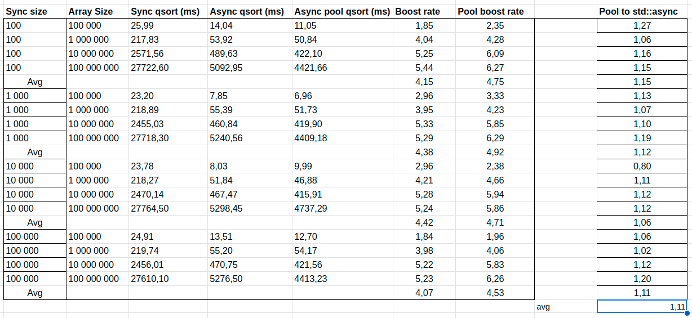

# Course work for parallel computing

## The task

The task is to implement a parallel version of quicksort algorithm using and compare it with the sequential version.

## The algorithm

The algorithm is based on the following steps:
1. Divide the array into two parts: the first one contains elements less than the pivot, the second one contains elements greater than the pivot.
2. Sort the first part in parallel usgin std::async.
3. Sort the second part in parallel usgin std::async.
4. As the array passes into function as reference, no merge needed
5. Wait for std::future objects to complete.

## The results

The results are presented in the following table:

Looks like the best value of sync size is 10'000 because it is average 4.015 faster than the sequential version.
